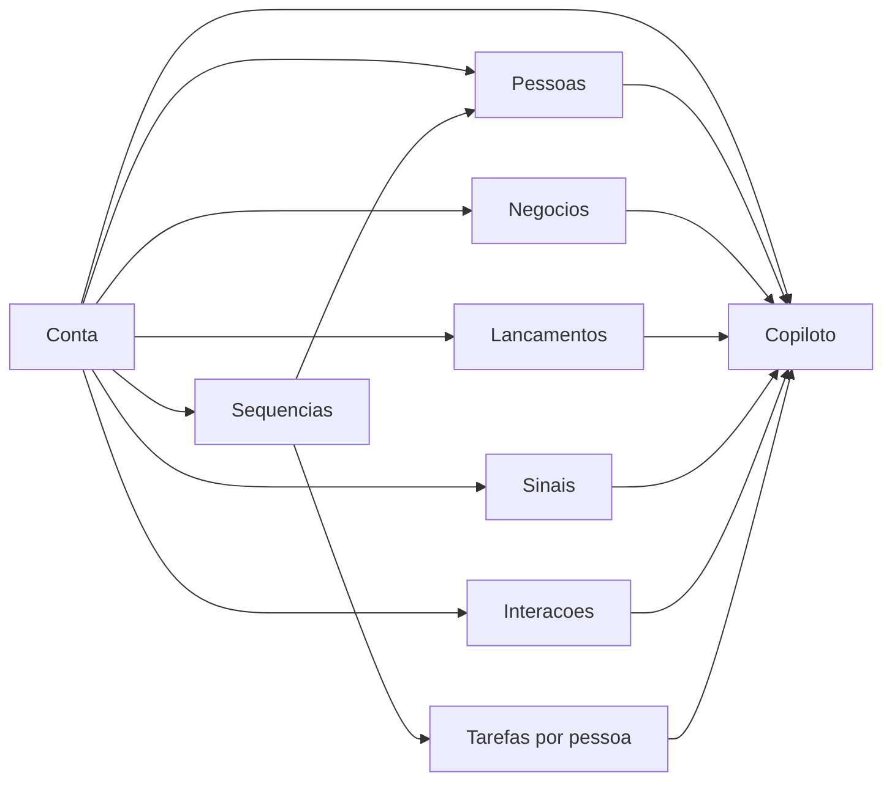

# EPIC: CRM 2.0 - contas estruturadas, sequencias por conta e copiloto operacional

## Entendimento do objetivo

O CRM precisa virar um centro operacional de contas, nao apenas um cadastro. A conta deve ser o eixo principal: nela vivem pessoas, negocios, lancamentos, sinais, interacoes, tarefas e sequencias. A navegacao deve permitir operar muitas contas com velocidade, mantendo contexto e reduzindo cliques mortos.

## Premissas de produto

- A lista de contas e a base de operacao para alto volume.
- O Kanban e uma visao complementar para acompanhar estados/pipeline, nao a unica forma de trabalhar.
- Sequencias sempre pertencem a uma conta.
- Uma sequencia nao pode rodar sem pelo menos uma pessoa vinculada a essa conta.
- O copiloto deve orientar proximas acoes a partir dos dados ja existentes, sem executar mudancas irreversiveis sem confirmacao.
- Cada PR deve ser pequeno, verificavel e reversivel.

## Modelo mental desejado

## Sequenciamento sugerido

1. Consolidar contratos de dados e estados de conta.
2. Criar lista de contas estilo Notion/Excel com paginacao de 25.
3. Adicionar filtros, ordenacao, colunas e estado em URL.
4. Reposicionar Kanban como view alternavel da mesma base de contas.
5. Reestruturar sequencias para conta + multiplas pessoas.
6. Gerar tarefas e estados de execucao por pessoa dentro da conta.
7. Criar copiloto flutuante com leitura de contexto.
8. Conectar copiloto a recomendacoes e handoffs de acoes.
9. Fechar com QA, performance e polimento de navegacao.

---

# Issue mae

## Titulo

EPIC: CRM 2.0 - contas estruturadas, sequencias por conta e copiloto operacional

## Corpo

### Objetivo

Transformar o CRM em um centro operacional ABM com contas como entidade central, operacao fluida para alto volume, sequencias por conta com pessoas selecionadas e um copiloto contextual para guiar proximas acoes.

### Escopo

- Lista de contas estilo Notion/Excel com paginacao de 25.
- Kanban como view complementar de contas.
- Sequencias vinculadas a conta e a uma ou mais pessoas.
- Copiloto flutuante com leitura de contexto e recomendacoes.
- Melhorias de navegacao entre contas, pessoas, negocios, lancamentos, sinais, interacoes e tarefas.

### Criterios de aceite

- Usuario consegue operar muitas contas pela lista paginada.
- Usuario alterna entre lista e Kanban sem perder contexto principal.
- Usuario nao consegue iniciar sequencia sem conta e pessoas.
- Usuario consegue ver, por conta, quais pessoas estao em sequencia.
- Copiloto abre de forma flutuante e apresenta orientacoes contextualizadas.
- Build, lint e testes passam em todos os PRs filhos.

---

# Issues filhas / PRs sugeridos

## 1. CRM: definir contratos de dados e estados operacionais de conta

### Objetivo

Definir claramente quais campos, estados e relacoes sustentam lista, Kanban, sequencias e copiloto.

### Escopo

- Auditar `Company`, `Contact`, `Deal`, `CompanyLaunch`, `AccountSignal`, `DailyTask`, `Sequence`.
- Definir estados de conta para pipeline/Kanban.
- Definir payloads minimos para lista, detalhe e copiloto.
- Documentar campos obrigatorios, opcionais e derivados.

### Criterios de aceite

- Documento de contrato criado/atualizado.
- Campos necessarios para as proximas issues identificados.
- Nenhuma tela alterada de forma funcional neste PR, salvo tipos auxiliares seguros.

## 2. CRM Contas: criar view de lista estilo Notion/Excel com paginacao de 25

### Objetivo

Adicionar uma lista operacional de contas para alto volume.

### Escopo

- View em tabela densa e escaneavel.
- Paginacao com 25 contas por pagina.
- Colunas iniciais: nome, status, score, cidade, segmento, modelo de venda, lancamento, VGV, midia mensal, responsavel, ultima interacao.
- Linha clicavel para detalhe.
- Acoes rapidas preservadas: editar, excluir, abrir detalhe.

### Criterios de aceite

- Lista carrega ate 25 itens por pagina.
- Estado vazio e loading estao claros.
- Usuario consegue ir para pagina anterior/proxima.
- Lista nao depende do Kanban para operar contas.

## 3. CRM Contas: filtros, busca, ordenacao e estado em URL

### Objetivo

Tornar a lista navegavel e compartilhavel.

### Escopo

- Busca por nome, cidade, dominio e CNPJ quando disponivel.
- Filtros: score, status, lancamento, responsavel, segmento, modelo de venda.
- Ordenacao por nome, score, VGV, data de criacao e ultima interacao.
- Persistir filtros/pagina/view na URL.

### Criterios de aceite

- Recarregar a pagina preserva filtros e pagina.
- URL compartilhada abre a mesma visao.
- Reset de filtros volta para pagina 1.

## 4. CRM Contas: Kanban como view complementar de contas

### Objetivo

Manter Kanban para operacao visual, mas conectado a mesma base da lista.

### Escopo

- Toggle/list tabs: Lista e Kanban.
- Kanban agrupado por status operacional da conta.
- Cards resumidos com nome, score, responsavel, proximo passo e sinais principais.
- Abertura do detalhe sem perder view/filtros.

### Criterios de aceite

- Usuario alterna lista/Kanban sem perder filtros.
- Kanban nao substitui a lista.
- Cards carregam rapido e mostram somente informacao acionavel.

## 5. CRM Contas: navegacao fluida entre conta, pessoas, negocios e acoes

### Objetivo

Reduzir navegacao travada e manter o usuario em contexto.

### Escopo

- Drawer/sheet para criar contato dentro da conta.
- Drawer/sheet para criar negocio dentro da conta.
- Links cruzados consistentes: contato -> conta, negocio -> conta, conta -> contatos/negocios.
- Breadcrumb/voltar preservando origem quando possivel.
- Acoes rapidas no detalhe: adicionar pessoa, adicionar negocio, adicionar sinal, iniciar sequencia.

### Criterios de aceite

- Criar pessoa dentro de conta preenche a conta automaticamente.
- Criar negocio dentro de conta preenche a conta automaticamente.
- Usuario nao precisa voltar para listas globais para concluir uma acao basica.

## 6. Sequencias: remodelar fluxo para conta + multiplas pessoas

### Objetivo

Corrigir o conceito central: sequencia e por conta e roda para pessoas selecionadas dentro dela.

### Escopo

- Revisar modelo atual de sequencias.
- Introduzir conceito de `account_sequence` ou equivalente.
- Uma sequencia precisa de `company_id`.
- Uma sequencia precisa de uma lista de `contact_ids`.
- Bloquear criacao/inicio sem pessoas selecionadas.

### Criterios de aceite

- Nao existe sequencia sem conta.
- Nao existe sequencia ativa sem pelo menos uma pessoa.
- Pessoas selecionadas pertencem a conta escolhida.

## 7. Sequencias: UI de selecao de conta e pessoas no plural

### Objetivo

Criar experiencia clara para escolher conta e multiplas pessoas.

### Escopo

- Campo de selecao/busca de conta.
- Lista de pessoas da conta com multi-select.
- Estado vazio quando a conta nao tem pessoas.
- CTA para adicionar pessoa sem sair do fluxo.
- Preview das pessoas selecionadas.

### Criterios de aceite

- Selecionar conta carrega somente pessoas daquela conta.
- Usuario consegue selecionar 1..N pessoas.
- Sem pessoas, a UI orienta adicionar pessoa primeiro.

## 8. Sequencias: gerar tarefas por pessoa e acompanhar execucao por conta

### Objetivo

Transformar sequencias em acoes rastreaveis por pessoa dentro de uma conta.

### Escopo

- Gerar tarefas por pessoa, canal e dia.
- Exibir progresso da sequencia na conta.
- Mostrar status por pessoa: pendente, feito, respondeu, pausado, removido.
- Pausar/retomar sequencia por conta.

### Criterios de aceite

- Cada pessoa selecionada recebe tarefas correspondentes.
- O detalhe da conta mostra progresso da sequencia.
- Marcar tarefa como feita atualiza progresso.

## 9. Copiloto: shell flutuante estilo Notion dentro do CRM

### Objetivo

Criar a interface base do copiloto como pop-up flutuante contextual.

### Escopo

- Botao flutuante persistente em areas CRM.
- Painel/pop-up abrindo sem trocar rota.
- Estados: fechado, aberto, carregando contexto, erro, pronto.
- Contexto atual detectado por rota: lista de contas, detalhe de conta, contatos, negocios, comando do dia.

### Criterios de aceite

- Copiloto abre em qualquer tela principal do CRM.
- Copiloto identifica a pagina/contexto atual.
- UI nao bloqueia a operacao principal.

## 10. Copiloto: agregador de contexto de conta

### Objetivo

Montar a camada que coleta dados relevantes para orientar o usuario.

### Escopo

- Para detalhe de conta: conta, pessoas, negocios, lancamentos, sinais, interacoes, tarefas, sequencias.
- Para lista: filtros ativos, contas visiveis, estatisticas, contas prioritarias.
- Normalizar contexto em payload pequeno para IA.
- Proteger contra payload grande demais.

### Criterios de aceite

- Agregador retorna contexto estruturado.
- Payload tem limite e priorizacao.
- Falhas parciais nao derrubam o painel.

## 11. Copiloto: recomendacoes e proximas acoes com Claude

### Objetivo

Usar IA para orientar, nao apenas responder texto generico.

### Escopo

- Edge function/API para gerar recomendacoes.
- Recomendar proximas acoes: quem contatar, que sinal adicionar, que sequencia iniciar, que dado falta.
- Mostrar justificativa curta baseada nos dados.
- Oferecer botoes de handoff: abrir contato, criar tarefa, iniciar sequencia, adicionar sinal.

### Criterios de aceite

- Recomendacoes citam dados reais do contexto.
- Usuario consegue acionar proximos passos a partir do copiloto.
- Acoes sensiveis pedem confirmacao.

## 12. QA: performance, confiabilidade e experiencia de alto volume

### Objetivo

Garantir que o CRM continue funcional com muitas contas.

### Escopo

- Testar paginacao, filtros e navegacao.
- Testar sequencia com conta sem pessoas, uma pessoa e multiplas pessoas.
- Testar empty/loading/error states.
- Validar lint/build/test.
- Medir queries principais e evitar carregar dados pesados na lista.

### Criterios de aceite

- Build, lint e testes passam.
- Lista continua responsiva com alto volume.
- Sequencias bloqueiam estados invalidos.
- Copiloto lida bem com contexto ausente ou incompleto.

